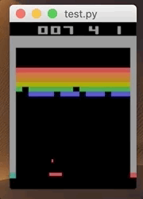

# DQN

这里只考虑了Breakout游戏。

测试pretrained.pth的效果

```shell
cd DQN
python test.py --model_path ./pretrained.pth
```



注意和标准的DQN的实现的区别：

* 虽然DQN不强制要求多进程，但是这里依然使用了多进程加快学习效率
* 这里将DQN的Experience Memory（ER）放在了GPU中，可以加快学习效率，但是会限制ER的大小
* 不过由于从不同进程中得到的经验相关性较小，使用多进程的方式可以不需要太大的ER

